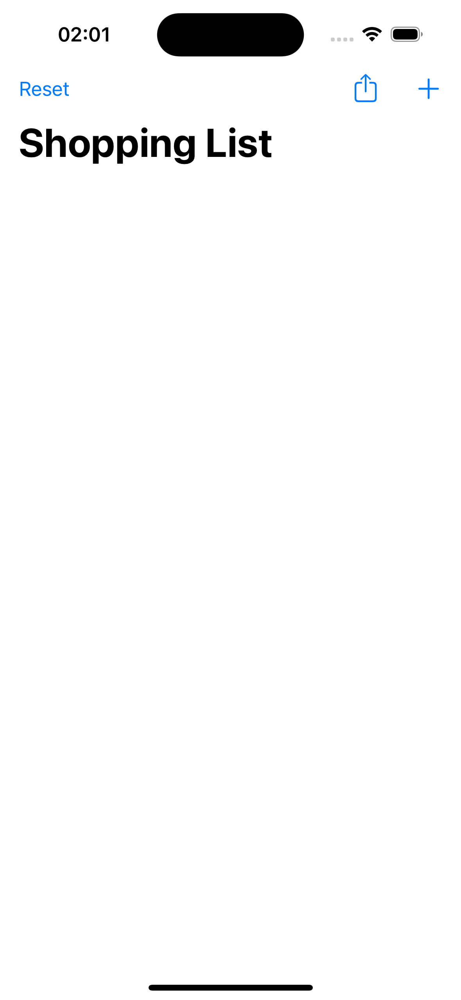
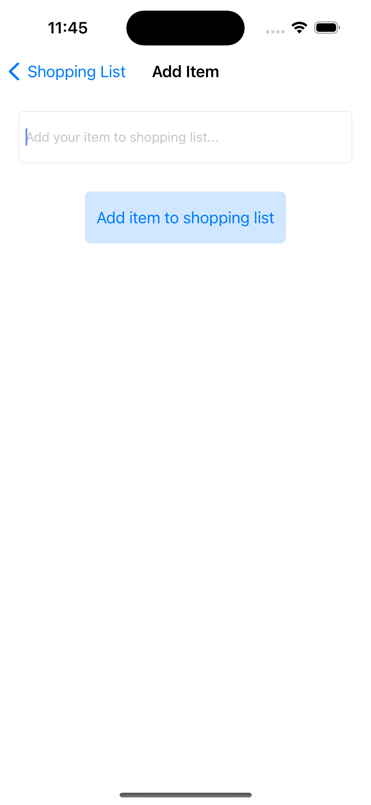
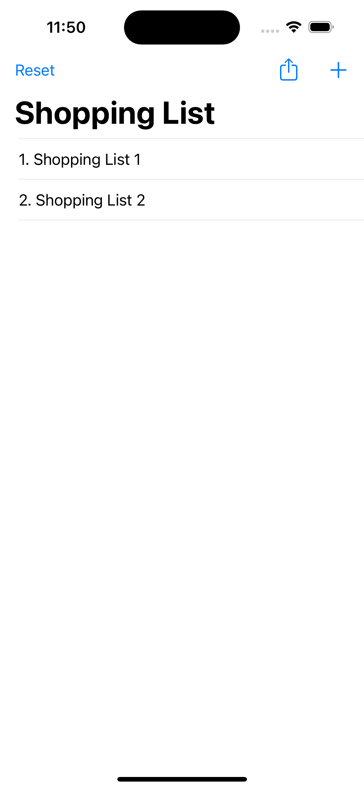

# Card-Workout-App
### Simple Shopping List application using UIKit and storyboard

- The goal of the application is to give the user the opportunity for a simple solution of adding shopping items in his list, which at the end can be shared as a text format for further use in other applications

> Learned how to use Apple UIBarButtons in left or right side of NavigationController

> Learned how to use NotificationCenter for obersving reloading and updating existing data from one to another screen

> Learned how to update TableView based on inserting elements in array

> Learned how to use UIActivityViewController for sharing specific data from application

> Learned how to use UIAlertController, both for entering elements in a array, and for simple notification to the user that some action is not allowed

### App preview

 

**NOTE**: Reset restriction is set, as Poppup Alert, if shopping list is empty. The same restriction is set for the share button.
